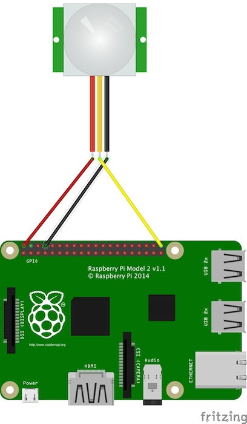

# Passive Infrared Motion Sensor, HC-SR501
The HC-SR501 is a passive infrared motion sensor. The PIR sensors we’ll be using in this lab have three pins: ground, digital out and 3-5VDC in. At idle, when no motion has been detected, the digital out will remain low. When motion is detected, the digital out will pulse high (3.3V) and we’ll the Raspberry Pi GPIO trigger feature to sense this. The HC-SR501 sensor has a range of approximately 7 meters, and a 110° x 70° detection range.

# Wiring the Sensor
To wire the PIR sensor to the RaspberryPi2, connect the pins as shown in the following diagram:

The connections may be made directly from the RaspberryPi GPIO header to the sensor using the female/female jumper wires:

* Sensor VCC pin connected to the Pi 5V Pin2
* Sensor OUT pin connected to the Pi GPIO21 Pin40
* Sensor GND pin connected to the Pi Ground Pin6

The following pin header diagram shows the header and Broadcom naming convention:

# Python usage
The first version (poll_motion.py) sits in a loop waiting for the GPIO pin to go to a high state. To test the motion detection, have the sensor pointed away from you, and then move your hand in front the sensor to trigger the GPIO pin to read a high value.

	root@raspberrypi:/media/github/rpi_HC-SR501# python poll_motion.py 
	PIR Module Test (CTRL+C to exit)
	Ready
	Motion Detected: 1
	Motion Detected: 2
	Motion Detected: 3
	Motion Detected: 4
	Motion Detected: 5
	Motion Detected: 6
	^CTraceback (most recent call last):
	  File "poll_motion.py", line 20, in <module>
		time.sleep(1)
	KeyboardInterrupt

## Using the GPIO trigger callback
The second version (sense_motion.py) uses the GPIO trigger callback to be told when the GPIO pin state goes to from low to the high state on the rising edge of the change. Run the sense_motion.py script and again move your hand in front of the sensor to trigger the motion detection callback:

	root@raspberrypi:/media/github/rpi_HC-SR501# python sense_motion.py 
	PIR Module Test (CTRL+C to exit)
	Ready
	Motion Detected
	Motion Detected
	^CQuit
	root@raspberrypi:/media/github/rpi_HC-SR501#
	
## Adding MQTT messaging to python
Publishing the motion detection to the MQTT broker is only partially completed in the sense_motion_mqtt.py script. Take a look at the script and incorprate the motion detection code into this script to enable the send of a message in the motion detection callback function.

# node usage
To run the nodejs client that uses the GPIO trigger callback to be told when the GPIO pin state goes to from low to the high state on the rising edge of the change, use:

	root@raspberrypi:/media/github/rpi_HC-SR501# node sense_motion.js 
	Monitoring...
	Motion Detected: 1
	Motion Detected: 1
	Motion Detected: 1
	^CExiting

## Adding MQTT messaging to node
Publishing the motion detection to the MQTT broker is only partially completed in the sense_motion_mqtt.js script. Take a look at the script configure the id varaible to be a unique value so that the topic is unique to your RaspberryPi.

# Java usage
The Java client makes use of the [Pi4j](http://pi4j.com/) project which provides an object-oriented I/O API and implementation libraries for Java Programmers to access the full I/O capabilities of the Raspberry Pi platform. This project abstracts the low-level native integration and interrupt monitoring to enable Java programmers to focus on implementing their application business logic. 

The code for the Java motion sensor client is found in the org.jboss.summit2015.hcsr501.MotionSensor class. While you wire up the sensor as indicated, when you look at the code, note that the Pi4j project uses a different numbering scheme for the pins in it's API, and this scheme is shown in this figure:

To run the Java client, use the Gradle script and run:

	root@raspberrypi:/media/github/rpi_HC-SR501# gradle motionLoop
	Starting a new Gradle Daemon for this build (subsequent builds will be faster).
	:compileJava
	:processResources UP-TO-DATE
	:classes
	:motionLoop
	PIR Module Test (CTRL+C to exit)
	Ready
	 --> GPIO TRIGGER CALLBACK RECEIVED 
	 --> GPIO TRIGGER CALLBACK RECEIVED 
	 --> GPIO TRIGGER CALLBACK RECEIVED 
	 --> GPIO TRIGGER CALLBACK RECEIVED 
	 --> GPIO TRIGGER CALLBACK RECEIVED 
	 --> GPIO TRIGGER CALLBACK RECEIVED 
	 --> GPIO TRIGGER CALLBACK RECEIVED 
	 --> GPIO TRIGGER CALLBACK RECEIVED 
	^CInterrupted, stopping...
	root@raspberrypi:/media/github/rpi_HC-SR501#

## Adding MQTT messaging to Java
The org.jboss.summit2015.hcsr501.MotionSensorMQTT version of the client sends the motion events to an MQTT broker. You can run this version of the client using:

	root@raspberrypi:~/Labs/rpi_HC-SR501# gradle motionLoopMQTT
	Starting a new Gradle Daemon for this build (subsequent builds will be faster).
	:compileJava
	:processResources UP-TO-DATE
	:classes
	:motionLoopMQTT
	/usr/lib/jvm/jdk-8-oracle-arm-vfp-hflt/bin/java -XX:+HeapDumpOnOutOfMemoryError -Dfile.encoding=UTF-8 -Duser.country=GB -Duser.language=en -Duser.variant -cp /root/Labs/rpi_HC-SR501/build/classes/main:/root/Labs/rpi_HC-SR501/build/resources/main:/root/.gradle/caches/modules-2/files-2.1/org.eclipse.paho/org.eclipse.paho.client.mqttv3/1.0.2/11752d3f24d1a9deda4533a7ca18d8496417ceeb/org.eclipse.paho.client.mqttv3-1.0.2.jar:/root/.gradle/caches/modules-2/files-2.1/com.pi4j/pi4j-core/1.0/b479fd891a87ab398c1d9abef19de95dc8037d9/pi4j-core-1.0.jar:/root/.gradle/caches/modules-2/files-2.1/com.pi4j/pi4j-device/1.0/a6f2229d4f6f7201a839720c948eb64e2178b3b3/pi4j-device-1.0.jar:/root/.gradle/caches/modules-2/files-2.1/com.pi4j/pi4j-gpio-extension/1.0/8a9b6a3ee2be95f5848a2f4e2d876e9284e649d8/pi4j-gpio-extension-1.0.jar org.jboss.summit2015.hcsr501.MotionSensorMQTT 100 
	Output:
	
	PIR Module Test (CTRL+C to exit)
	Connected to: tcp://iot.eclipse.org:1883
	Ready
	{'event':'motion-detection', 'time': 1434323074251}
	{'event':'motion-detection', 'time': 1434323393745}

You can see the temperature readings as they are published by running the readMQTT task in a separate console, or even better, you laptop to verifying the readings are getting off of the RaspberryPi.

	root@raspberrypi:~/Labs/rpi_HC-SR501# gradle readMQTT
	Starting a new Gradle Daemon for this build (subsequent builds will be faster).
	:compileJava UP-TO-DATE
	:processResources UP-TO-DATE
	:classes UP-TO-DATE
	:readMQTT
	/usr/lib/jvm/jdk-8-oracle-arm-vfp-hflt/bin/java -XX:+HeapDumpOnOutOfMemoryError -Dfile.encoding=UTF-8 -Duser.country=GB -Duser.language=en -Duser.variant -cp /root/Labs/rpi_HC-SR501/build/classes/main:/root/Labs/rpi_HC-SR501/build/resources/main:/root/.gradle/caches/modules-2/files-2.1/org.eclipse.paho/org.eclipse.paho.client.mqttv3/1.0.2/11752d3f24d1a9deda4533a7ca18d8496417ceeb/org.eclipse.paho.client.mqttv3-1.0.2.jar:/root/.gradle/caches/modules-2/files-2.1/com.pi4j/pi4j-core/1.0/b479fd891a87ab398c1d9abef19de95dc8037d9/pi4j-core-1.0.jar:/root/.gradle/caches/modules-2/files-2.1/com.pi4j/pi4j-device/1.0/a6f2229d4f6f7201a839720c948eb64e2178b3b3/pi4j-device-1.0.jar:/root/.gradle/caches/modules-2/files-2.1/com.pi4j/pi4j-gpio-extension/1.0/8a9b6a3ee2be95f5848a2f4e2d876e9284e649d8/pi4j-gpio-extension-1.0.jar org.jboss.summit2015.hcsr501.MqttRead 100 
	When running on a host other than the RaspberryPi, pass in -Pid=NNN... where id is RHSummit2015_temp_rpi_hcsr501/id used by the sender
	Output:
	
	Connected to: tcp://iot.eclipse.org:1883 as RecvMotionMQTT-1, reading 100 messages
	messageArrived, topic=RHSummit2015_temp_rpi_hcsr501/1, msg={'event':'motion-detection', 'time': 1434323393745}
	messageArrived, topic=RHSummit2015_temp_rpi_hcsr501/1, msg={'event':'motion-detection', 'time': 1434323481711}

# Triggering LED from MQTT Message?
TODO: Perhaps add some feedback loop that has the RaspberryPi receiving a message and lighting a LED as a more advanced part of the project.

# Monitoring the GPIO pin state from command line
The GPIO pins that are enabled have their values availble from the /sys/class/gpio/ filesystem. When you are running
one of the clients above, you can watch the GPIO21 pin state transition from high to low and back using a simple script
like the following:

	root@raspberrypi:~# ls /sys/class/gpio/gpio21
	active_low  device  direction  edge  subsystem	uevent	value
	root@raspberrypi:~# while true; do
	> cat /sys/class/gpio/gpio21/value
	> sleep 1
	> done
	0
	0
	0
	0
	0
	0
	1
	1
	1
	1
	0
	0
	1
	1
	0
	0
	0
	0
	^C

This shows two transitions from low to high corresponding to two motion detection events.
